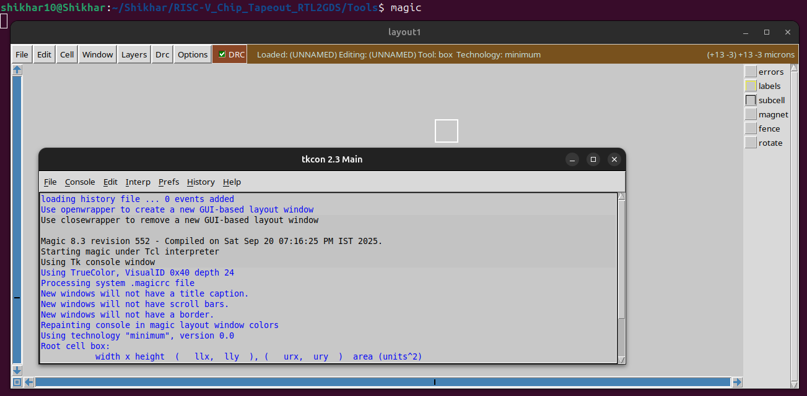

# Digital VLSI SOC Design and Planning

#### The Digital VLSI SoC Design and Planning process begins with Chip Modelling (O1), where a C model is created from the design specifications and verified using a C-language testbench. This is followed by the RTL Architect Stage (O2), which produces a "soft copy" of the hardware using RTL languages like Verilog. The design then undergoes ASIC Synthesis, converting the RTL into a Gate Level Netlist while integrating various IPs. The SoC Integration Phase (O3) involves physical design steps such as floorplanning, placement, and routing to produce a GDSII file. Finally, the design is verified with DRC/LVS checks before being fabricated, resulting in the final chip (O4), which should be functionally equivalent to the initial models and architectures. A design that has been successfully manufactured and tested on a real chip is referred to as a "silicon-proven" design.
---

# System Information and Tool Installation Guide

#### This guide provides instructions to install the essential EDA tools required for the RISC-V Chip Tapeout project.
---

## System Information

<p align="center">
  
</p>

---

## Tool Installation 

### 1. Yosys 

``` bash
git clone https://github.com/YosysHQ/yosys.git
cd yosys
git submodule update --init --recursive
sudo apt-get install build-essential clang lld bison flex libfl-dev \
	libreadline-dev gawk tcl-dev libffi-dev git \
	graphviz xdot pkg-config python3 libboost-system-dev \
	libboost-python-dev libboost-filesystem-dev zlib1g-dev
make config-gcc
make
sudo make install
```

### 2. Iverilog

``` bash
sudo apt-get update
sudo apt-get install iverilog
```

### 3. GTKWave

``` bash
sudo apt-get update
sudo apt-get install gtkwave
```

### 4. Ngspice

``` bash
sudo apt-get update
sudo apt-get install ngspice
```

### 5. Magic VLSI Layout Tool

``` bash
sudo apt-get install m4
sudo apt-get install tcsh
sudo apt-get install csh
sudo apt-get install libx11-dev
sudo apt-get install tcl-dev tk-dev
sudo apt-get install libcairo2-dev
sudo apt-get install mesa-common-dev libglu1-mesa-dev
sudo apt-get install libncurses-dev

git clone https://github.com/RTimothyEdwards/magic
cd magic

./configure

make

sudo make install
```
---

## Tool Verification

### 1. Yosys 
<p align="center">
  
</p>

### 2. Iverilog

<p align="center">
  
</p>

### 3. GTKWave

<p align="center">
  
</p>

### 4. Ngspice
<p align="center">
  
</p>

### 5. Magic VLSI Layout Tool
<p align="center">
  
</p>
